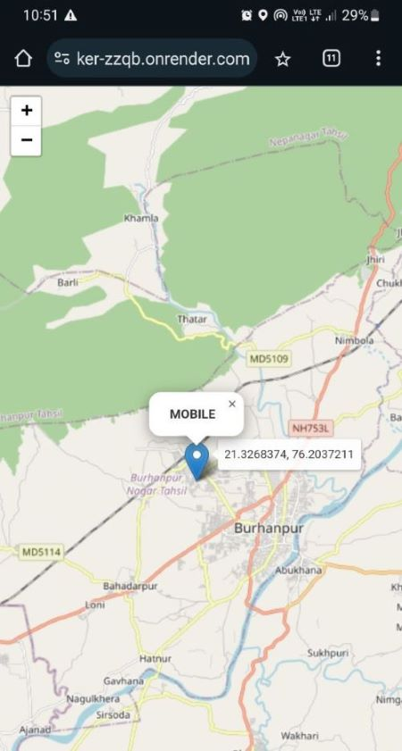

# Realtime Tracker

This Node.js application functions as a real-time tracker that displays your current location on a map and dynamically updates the marker as you move by the use of web sockets.
The location data is sent to the server and the frontend back-and-forth by the use of web sockets.

## Features

- **Popup for each marker**: Name of the user is binded to each marker as a popup.
- **Tool-tip**: The location coordinates can be viewed on the tool-tip associated to each marker.
- **Dynamic location update**: The location of the device is updated every 5 sec in a high accuracy mode.
- **Multiple users support**: The users can join and view each others markers.

## Installation & Usage

#### To use Realtime-Tracker's hosted version, Just click on this link:
https://realtime-tracker-zzqb.onrender.com/

#### To use CampPrime locally, follow these steps:

1. Clone or download the repository from GitHub, Head over to the Terminal and execute this command:
- git clone https://github.com/Pranav-Malao/Realtime-Tracker.git

2. Navigate into the project directory:
- cd Realtime-Tracker

3. Install the necessary dependencies using npm:
- npm Install

#### Usage

- Once the application up and running, grant your browser the permission to access your location when prompted.
- Provide your name when prompted, this would be used to label your marker.
- The map should display your current location, and the marker should update as you move around.

#### Contact

- LinkedIn https://www.linkedin.com/in/pranav-malao-472500290/